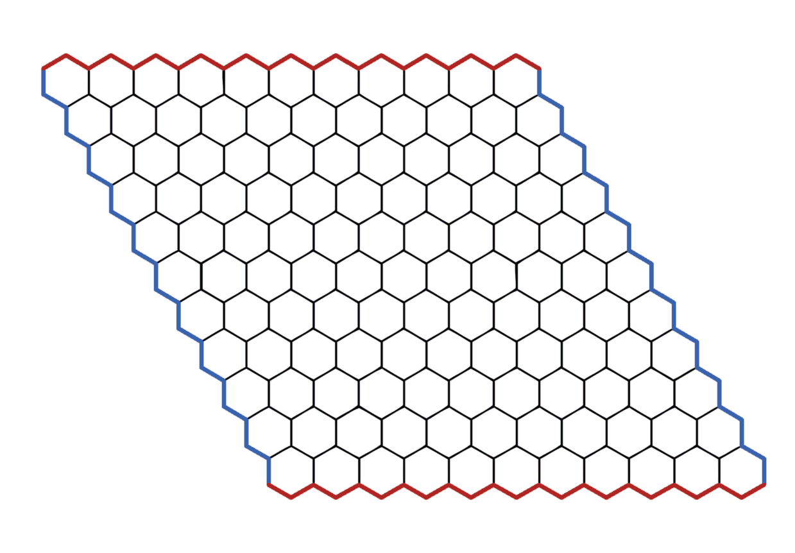
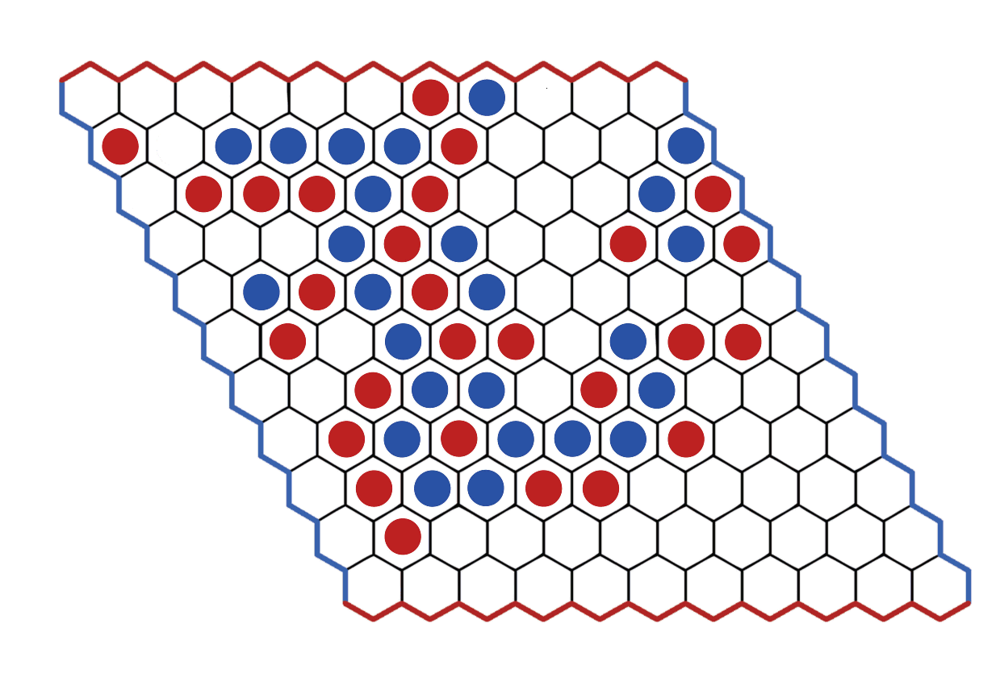
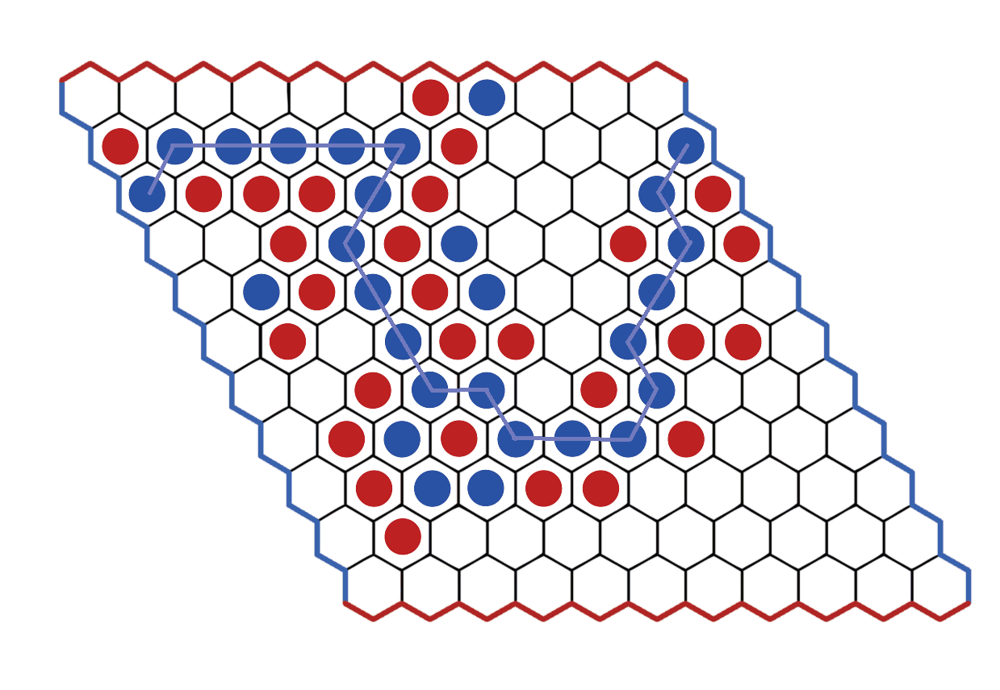
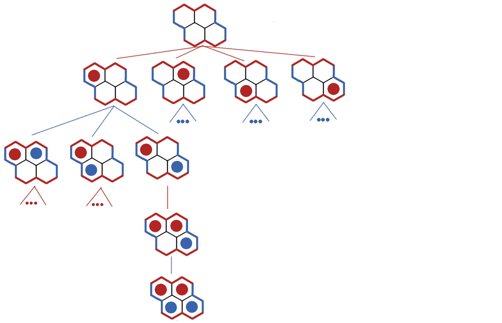
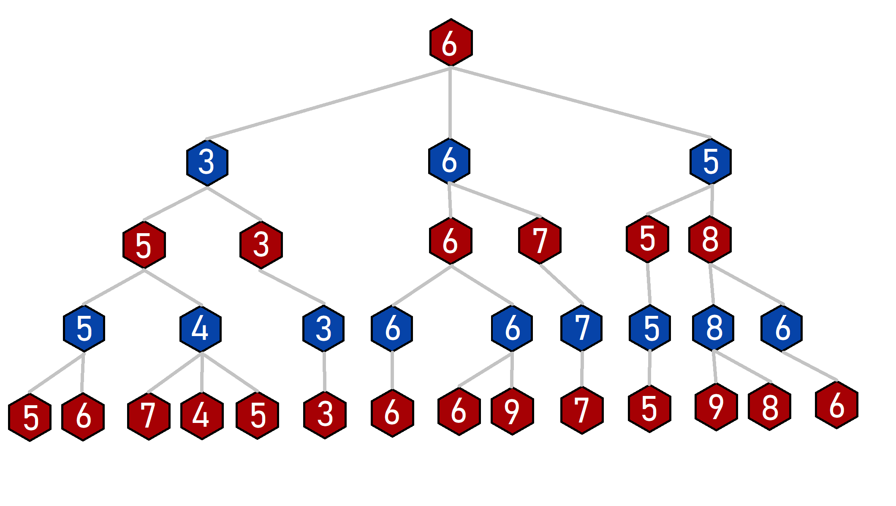
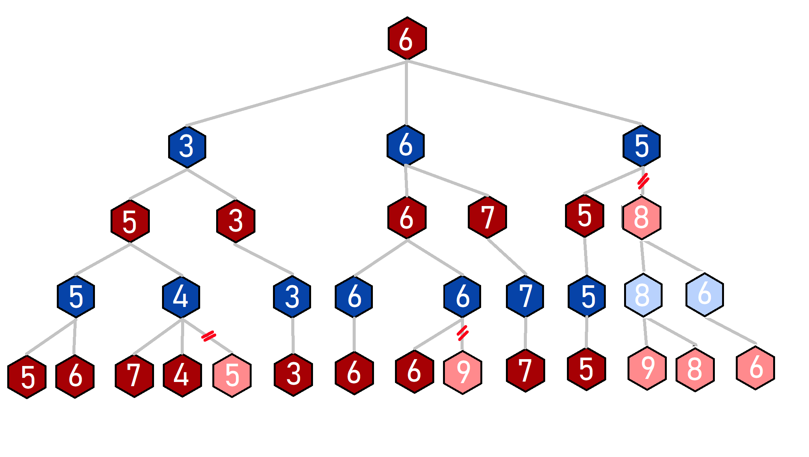
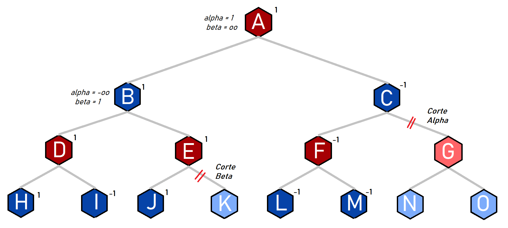

# Inteligencia Artificial
## Proyecto Búsqueda Adversarial
*Dayrene Fundora González C-511*

### Hex Game
*Hex* es un juego de mesa de *suma 0* con *"perfect information"*

##### Tablero
*Hex* es jugado en un tablero hecho de hexágonos. El mismo tablero tiene forma de rombo, como se muestra en la imagen. Las fichas se sitúan en los hexágonos del tablero. El tablero mostrado aquí tiene 11 fichas a cada lado del rombo, lo cual es un tamaño común para jugadores experimentados, pero el juego puede ser jugado en tableros de cualquier tamaño.




##### Reglas
> - Inicialmente el tablero está vacío.
> - A cada jugador se le asigna un color de fichas y dos laterales opuestos del tablero que tendrá que intentar conectar con sus fichas siguiendo las reglas del juego.
> - Los jugadores van colocando fichas por turnos sobre el tablero en casillas desocupadas.
> - Gana el primer jugador que consigue formar una línea de sus fichas que conecte sus dos laterales. 
> - No son posibles los empates.
> - Como el primer jugador tiene ventaja, se jugarán 2 partidas una con cada color de fichas.

.



##### Objetivo

El objetivo es hacer un camino con las fichas de tu color entre lados (del mismo color) opuestos del tablero. El jugador contrario intentara hacer una cadena entre los lados del otro color del tablero. La cadena no tiene que estar en línea recta, siempre que la cadena esté cerrada, es decir, las fichas se encuentran directamente una al lado de la otra. En el juego que se muestra a continuación, el azul ganó.


### Definiciones

La información completa de este juego, y cualquier juego combinatorio, puede ser representado en una jerarquía llamada *game-tree*. Un **árbol** de juego tiene una **raíz**, la cual representa el estado de inicio de un juego y sus **nodos** son estados validos del tablero mientras que las **aristas** son movimientos o jugadas legales, en los que se llega de un estado del juego (nodo padre) hacia otro estado del juego (nodo hijo) después de aplicar el movimiento. El árbol representa la información completa del juego ya que tiene el conjunto completo de todas las posiciones del tablero. En un árbol de juego, un juego o partido es un único **camino** comenzando desde la raíz (estado inicial) y termina un una **nodo hoja**. Las representaciones de un tablero en los nodos hojas son llamados *tablero terminal*. Cada **nivel** del árbol representa las opciones de **jugada** de un **jugador** para ese turno. Un jugador es un agente que dado un tablero, es capaz de generar la próxima jugada según algún criterio que lleve a la victoria.



### Minimax Search
`Minimax` es un algoritmo recursivo el cual se usa para elegir un movimiento optimo para un jugador asumiendo que el oponente también jugara de manera optima. Como su nombre sugiere, su meta es minimizar la perdida máxima (minimizar el peor escenario).

> Se puede pensar del algoritmo como una representación del proceso del pensamiento humano que dice: "Bien, si hago este movimiento, entonces mi oponente solo puede  hacer dos movimientos, y cada uno de eso me permite ganar. Así que es la jugada correcta".

Una búsqueda `minimax` es una búsqueda exhaustiva en profundidad de un árbol de juego que devuelve un valor *"score"*. Una búsqueda `minimax` tiene dos fases llamadas fase de maximización y fase de minimización, respectivamente. La fase de maximización ocurre en todas las posiciones del tablero donde el primer jugador tiene el turno y la fase de minimización ocurre en todas las posiciones del tablero donde el segundo jugador tiene el turno. La fase de maximización devuelve el mayor *score* asignado a los sucesores mientras que la fase de minimización devuelve el valor más pequeño asignado a los sucesores. 


Los estados finales del tableros o *nodos hojas* se le asigna `1` si el primer jugador gana y `-1` en caso contrario. A medida que la búsqueda hace `backtrack` desde las posiciones terminales, a los nodos en la fase de maximización se les asigna el valor más grande asignado a sus sucesores y a los nodos en la fase de minimización se les asigna el valor más pequeño asignado a sus sucesores. Entonces se selecciona el *camino* desde la *raíz* y el *nodo hoja* que represente la jugada con un mayor *`score`* en su camino.

```python
def maxplay(game, play, player, depth, h, moves):
    best = None
    best_value = -oo

    if game.winner() != EMPTY:
        return play, -1

    if not depth:
        return play, h(game, player)

    for x,y in moves(game, player):
        b, value = minplay(game.clone_play(x,y), (x,y), player, depth - 1, h, moves)

        if value > best_value:
            best = (x,y)
            best_value = value

    return best, best_value
```

```python
def minplay(game, play, player, depth, h, moves):
    best = None
    best_value = oo

    if game.winner() != EMPTY:
        return play, 1

    if not depth:
        return play, h(game, player)

    for x,y in moves(game, player):
        _, value = maxplay(game.clone_play(x,y), (x,y), player, depth - 1, h, moves)

        if value < best_value:
            best = (x,y)
            best_value = value

    return best, best_value
```

En ambos métodos chequeamos si la ultima jugada causo que el jugador ganara.
```python
    if game.winner() != EMPTY:
```

Se puso un limite de la profundidad de la búsqueda `depth` pues el árbol es muy grande para expandirlo hasta los nodos hoja.  Así que lo que hacemos es aplicar la heurística definida para el jugador, esta es la que define que arista se tomara.
```python
    if not depth:
        return play, h(game, player)
```

Después se trata en cada movimiento posible calcular recursivamente el *'score'*, si es el jugador que maximiza se pasa a `minplay` y si es el jugador que minimiza se pasa a `maxplay`. Luego de tener el valor de todos sus nodos sucesores se guarda el de mayor valor en `maxplay` y el de menor en `minplay`.

```python
   for x,y in moves(game, player):
        b, value = minplay(game.clone_play(x,y), (x,y), player, depth - 1, h, moves)

        if value > best_value:
            best = (x,y)
            best_value = value
```
```python
for x,y in moves(game, player):
        _, value = maxplay(game.clone_play(x,y), (x,y), player, depth - 1, h, moves)

        if value < best_value:
            best = (x,y)
            best_value = value
```
### α-β Minimax
> La idea detrás de esta mejora del simple `minimax` es que podemos reducir el numero de ramas evaluadas.

Al buscar el árbol completo se crea un jugador que nuca pierde pues conoce completa todos los resultados posibles. Pero a diferencia del Tic Tac Toe que es un tablero pequeño, desplegar todas sus jugadas no es difícil en una maquina de computo. Pero para un juego como el `Hex` que normalmente se juega en tableros de *11x11*, lo cual no es una opción. Por lo que agregamos una poda para reducir el número de nodos buscados, sin afectar su optimalidad.

  El algoritmo de poda `α-β` es una extensión de la búsqueda por `minimax` que tiene dos valores `alpha` y `beta` que atan el *'score'* en cada nodo o estado del juego. El valor de `alpha` es el menor valor atado al nodo el cual es maximizado en la búsqueda mientras que `beta` es el mayor y es minimizado en la búsqueda.



La poda es desencadenada por dos condiciones conocidas como condiciones de corte `alpha` y `beta`. Una condición de corte `beta` ocurre mientras se busca el nodo `E`. Ya que la búsqueda esta maximizando al nodo `E` y el valor de este es mayor o igual al valor `beta` de `B`, y como la búsqueda minimiza en el nodo `B`, la búsqueda en el nodo `E` nunca devolverá un valor menor del valor en el nodo `B`. Por ello, lo que queda por revisar del sub-árbol con raíz `E` se elimina de la búsqueda. De manera similar, una condición de corte `alpha` ocurre mientras se busca el nodo `C`. Ya que la búsqueda esta minimiza al nodo `C` y el valor de este es menor o igual al valor `alpha` de `A`, y como la búsqueda maximiza en el nodo `A`, la búsqueda en el nodo `C` nunca devolverá un valor mayor del valor en el nodo `A`. Por ello, lo que queda por revisar del sub-árbol con raíz `C` se elimina de la búsqueda.


```python
def maxplay(game, play, player, depth, h, moves, alpha=-oo , beta=oo):
    best = None
    best_value = -oo

    if game.winner() != EMPTY:
        return play, -1

    if not depth:
        return play, h(game, player)

    for x,y in moves(game, player):
        b, value = minplay(game.clone_play(x,y), (x,y), player, depth - 1, h, moves)
        alpha = max(alpha, value)

        if alpha >= beta:
            break

        if value > best_value:
            best = (x,y)
            best_value = value
        
    return best, best_value
```

```python
def minplay(game, play, player, depth, h, moves, alpha=-oo , beta=oo):
    best = None
    best_value = oo

    if game.winner() != EMPTY:
        return play, 1

    if not depth:
        return play, h(game, player)

    for x,y in moves(game, player):
        _, value = maxplay(game.clone_play(x,y), (x,y), player, depth - 1, h, moves)
        beta = min(beta, value)

        if beta <= alpha:
            break
    
        if value < best_value:
            best = (x,y)
            best_value = value

    return best, best_value
```
Lo que se hizo fue agregar a los argumentos los valores de `alpha` y `betha` que por defecto tendrán valores de `α = menos infinito` e `β = infinito` , que es la cota que siempre se supera por el tipo de comparación para cada uno.
```python
def maxplay(game, play, player, depth, h, moves, alpha=-oo , beta=oo)
```

```python
def minplay(game, play, player, depth, h, moves, alpha=-oo , beta=oo)
```

Para el jugador que maximiza ponemos:

```python
alpha = max(alpha, best_value)
```

y para el jugador que minimiza:
```python
beta = min(beta, best_value)
```
Para ambos casos comprobamos
```python
if beta <= alpha:
    break
```
Si se rompe el ciclo, significa que no tenemos que evaluar mas ramas `α-β cutoff`. 

### Heurística Conectados(Básica)
Esta es una heurística muy básica en la que contamos la cantidad de piezas de un mismo jugador que están conectadas.

```python
def countConnected(game, player):
	queue = FIFO_Queue()
	counted = set()
 	connected = 0
        
	for i in range(game.size):
		for j in range(game.size):
			if game[i,j]==player:
	   			queue.add((i,j))
	...	
```
Primeramente guardamos en una cola todas las casillas ocupadas del jugador. Luego de cada casilla buscamos los *vecinos* que también sean casillas ocupadas por el jugador.
```python
	...
 	while len(queue) > 0:
		row, col=queue.get()
		neighbors=game.getNeighbors(row,col)
  		for n in neighbors:
			r, c = n
			if game[i,j] == player and n not in counted:
				counted.add((r, c))
				connected += 1
	
	return connected
```
Para seleccionar a los vecinos, esta el método implementado en la lógica del juego que devuelve los 6 vecinos de una pieza y también el siguiente método. Es una pequeña modificación de la heurística **Connected**, se llama **BetterConnected**. 

El único cambio es en la línea`neighbors=game.getNeighbors(row,col)`. Ahora en lugar de llamar al método de vecinos dado llama a `getRelevantNeighbors`.

Esta es su implementación:

```python
def getRelevantNeighbors(game, player, x, y):
	game[x, y]
	
	#we only care about right and left
 	relevantNeighborhoodWhite = [(-1, 1), (0, 1), (1, -1), (0, -1)]
 	#we only care about up and down
	relevantNeighborhoodBlack = [(1, -1), (1, 0), (-1, -1), (-1, 0)]
	neighborhood=[]
 
 	if player=='W':
		neighborhood=relevantNeighborhoodWhite
	else:
		neighborhood=relevantNeighborhoodBlack
 	
  	for neig in neighborhood:
		nx, ny = x + neig[0], y + neig[1]
		if game.checkInside(nx, ny):
			yield nx, ny	
```
Donde tomamos los vecinos en dependencia del color del jugador. Si es el jugador *blanco*, su objetivo es crear un camino que conecte el lado izquierdo con el derecho, por lo que no contamos con los vecinos que no nos conectan en esa dirección (los vecinos que solo llevan arriba o abajo). En caso contrario, si es el jugador *negro* como su objetivo es crear un camino que conecte el lado de arriba con el de abajo, solo tomamos los vecinos que nos conectan en esa dirección.


```python
def heuristic_coneccted(game, player):
    oponent='W' if player=='B' else 'B'
    
    ccp=countConnected(game,player,getRelevantNeighbors)
    cco=countConnected(game,oponent,getRelevantNeighbors)
    
    return (cco-ccp)/max(ccp,cco)
```
Si el resultado tiene valores cercanos a `1` indican una ventaja para el primer jugador, valores cercanos a `−1` indican ventaja para el segundo. Si restamos sus valores `ccp − cco` esta nos indicará  en signo quien lleva ventaja, para normalizar este resultado en el intervalo pedido `[-1, 1]`, la transformamos en `ccp − cco/max(ccp,cco)`.

### Comparaciones

   ❌✅

Se realizaron torneos utilizando la el módulo **tourney** ofrecido y se obtuvieron los siguientes resultados:

| 9.3 seg | Random | Rush | Connected |
| :---------: | :-------: | :----: | :---------: |
|   Victorias   | 4 | 5 | 15 |


| 6.5 seg | Random | Rush | BetterConnected |
| :---------: | :-------: | :----: | :---------: |
|   Victorias   | 4 | 8 | 12 |

Como era de esperarse la heurística `BetterConnected` es mas rápida que `Connected` pues se reduce la cantidad de vecinos a revisar por cada ficha. Pero los resultados no son mejores, por lo que la idea de solo tomar en cuenta los vecinos que contribuyen en al camino en la dirección del jugador no es mejor que `Connected`.